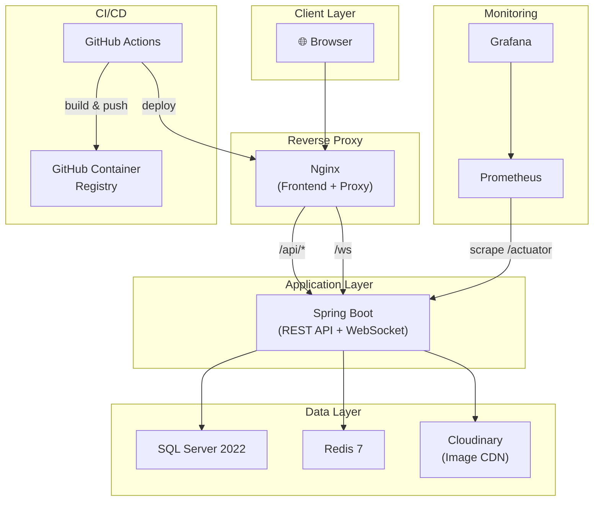

# 🛠️ Rundown Perbaikan Portofolio DevOps — EduConnect

**Tanggal Rencana:** 1 Juni 2026  
**Referensi:** [Analisa_Portofolio_DevOps_Junior.md](./Analisa_Portofolio_DevOps_Junior.md)  
**Tujuan:** Menaikkan skor portofolio dari **42% → ~75%+** untuk posisi DevOps Junior  
**Total Estimasi Waktu:** 8–12 hari kerja (part-time) / 5–7 hari kerja (full-time)  

---

## 📅 Timeline Overview

```
Fase 1 ██████░░░░░░░░░░░░░░░░░░░░░░░░░░  Hari 1-2  | Secret Management & Git Init
Fase 2 ░░░░░░██████░░░░░░░░░░░░░░░░░░░░  Hari 2-3  | Config Management & Code Hygiene
Fase 3 ░░░░░░░░░░░░████████░░░░░░░░░░░░  Hari 3-5  | Docker Hardening & Nginx
Fase 4 ░░░░░░░░░░░░░░░░░░░░████████░░░░  Hari 5-7  | CI/CD Pipeline
Fase 5 ░░░░░░░░░░░░░░░░░░░░░░░░░░░░████  Hari 7-9  | Monitoring & Observability
Fase 6 ░░░░░░░░░░░░░░░░░░░░░░░░░░░░░░██  Hari 9-12 | IaC, README & Finalisasi
```

---

## Fase 1: Secret Management & Git Initialization (Hari 1–2)

> **Prioritas:** 🔴 KRITIKAL  
> **Skor dampak:** Menaikkan skor `Security` dari 2/5 → 4/5 dan `Version Control` dari 1/5 → 4/5  

### 1.1 Bersihkan Semua Hardcoded Secrets

#### Task 1.1.1 — Refactor `application.yml` → gunakan environment variables
- [ ] **File:** `backend/src/main/resources/application.yml`
- [ ] **Aksi:** Ganti semua literal credentials dengan `${ENV_VAR:default_value}`

**Sebelum (SAAT INI):**
```yaml
spring:
  datasource:
    username: sa
    password: NaBiLa230798!
  mail:
    username: nalendrabintanglazuardi@gmail.com
    password: ygkyywaeaiynceem
```

**Sesudah (TARGET):**
```yaml
spring:
  datasource:
    url: ${SPRING_DATASOURCE_URL:jdbc:sqlserver://127.0.0.1:1433;databaseName=EduConnectDB;encrypt=true;trustServerCertificate=true;}
    username: ${DB_USERNAME:sa}
    password: ${DB_PASSWORD:}
    driverClassName: com.microsoft.sqlserver.jdbc.SQLServerDriver
  mail:
    host: ${MAIL_HOST:smtp.gmail.com}
    port: ${MAIL_PORT:587}
    username: ${MAIL_USERNAME:}
    password: ${MAIL_PASSWORD:}
```

#### Task 1.1.2 — Refactor `docker-compose.yml` → gunakan `.env` file
- [ ] **File:** `docker-compose.yml`
- [ ] **Aksi:** Ganti hardcoded `SA_PASSWORD` dan semua secrets

**Sesudah (TARGET):**
```yaml
services:
  sqlserver:
    image: mcr.microsoft.com/mssql/server:2022-latest
    container_name: educonnect-sqlserver
    environment:
      - ACCEPT_EULA=Y
      - SA_PASSWORD=${DB_PASSWORD}
      - MSSQL_PID=Developer
    # ...

  backend:
    # ...
    environment:
      - SPRING_DATASOURCE_URL=jdbc:sqlserver://sqlserver:1433;databaseName=EduConnectDB;encrypt=true;trustServerCertificate=true;
      - DB_USERNAME=${DB_USERNAME}
      - DB_PASSWORD=${DB_PASSWORD}
      - MAIL_USERNAME=${MAIL_USERNAME}
      - MAIL_PASSWORD=${MAIL_PASSWORD}
      - CLOUDINARY_URL=${CLOUDINARY_URL}
      - JWT_SECRET=${JWT_SECRET}
```

#### Task 1.1.3 — Buat `.env.example` (tanpa nilai secret)
- [ ] **File BARU:** `.env.example` (root project)
- [ ] **Aksi:** Template referensi bagi developer lain

```env
# ===== DATABASE =====
DB_USERNAME=sa
DB_PASSWORD=<your_secure_password_here>

# ===== EMAIL (SMTP) =====
MAIL_USERNAME=<your_email@gmail.com>
MAIL_PASSWORD=<your_app_password_here>

# ===== CLOUDINARY =====
CLOUDINARY_URL=cloudinary://<api_key>:<api_secret>@<cloud_name>

# ===== JWT =====
JWT_SECRET=<your_256bit_secret_key_here>

# ===== SPRING PROFILE =====
SPRING_PROFILES_ACTIVE=dev
```

#### Task 1.1.4 — Bersihkan `.env` backend yang berisi credentials asli
- [ ] **File:** `backend/.env`
- [ ] **Aksi:** Hapus isi literal Cloudinary URL, ganti dengan placeholder

#### Task 1.1.5 — Sanitasi dokumen `Masterplan_EduConnect.md`
- [ ] **File:** `Plan_Project/Masterplan_EduConnect.md`
- [ ] **Aksi:** Hapus baris yang mengekspos username `sa`, password, dan IP database (Section 2.4)
- [ ] **Ganti dengan:**
  ```
  *   **RDBMS:** Microsoft SQL Server
  *   **Host:** Dikonfigurasi via environment variable
  *   **Credentials:** Dikelola via `.env` file (tidak di-commit ke repository)
  ```

**✅ Verifikasi Task 1.1:**
```bash
# Pastikan tidak ada secrets yang tersisa di source code
grep -rn "NaBiLa230798" . --include="*.yml" --include="*.yaml" --include="*.java" --include="*.md"
grep -rn "ygkyywaeaiynceem" . --include="*.yml" --include="*.yaml"
grep -rn "nalendrabintanglazuardi" . --include="*.yml" --include="*.yaml"
# Semua command harus mengembalikan 0 hasil
```

---

### 1.2 Inisiasi Git Repository

#### Task 1.2.1 — Buat `.gitignore` root project yang komprehensif
- [ ] **File BARU:** `.gitignore` (root project)

```gitignore
# ===== SECRETS =====
.env
*.env.local
!.env.example

# ===== IDE =====
.idea/
.vscode/
*.iml
*.iws
*.ipr

# ===== OS =====
.DS_Store
Thumbs.db

# ===== Backend (Java/Maven) =====
backend/target/
backend/.mvn/wrapper/maven-wrapper.jar
backend/*.jar

# ===== Frontend (Node) =====
frontend/node_modules/
frontend/dist/
frontend/.cache/

# ===== Docker =====
docker-compose.override.yml

# ===== Logs =====
*.log
logs/

# ===== Reports =====
backend/rapor/
```

#### Task 1.2.2 — Inisiasi Git repository
- [ ] **Perintah:** Jalankan di root project

```bash
cd C:\Antigravity\A6

# Inisiasi repo
git init

# Set konfigurasi lokal
git config user.name "Nalendra Bintang"
git config user.email "nalendrabintang@example.com"

# Tambahkan .gitignore terlebih dahulu
git add .gitignore
git commit -m "chore: initialize repository with comprehensive .gitignore"
```

#### Task 1.2.3 — Buat initial commit yang terstruktur (Conventional Commits)
- [ ] **Aksi:** Commit per komponen, bukan satu commit raksasa

```bash
# Commit 1: Backend core
git add backend/pom.xml backend/src/main/java/com/educonnect/EduConnectApplication.java
git add backend/src/main/java/com/educonnect/entity/
git add backend/src/main/java/com/educonnect/repository/
git commit -m "feat(backend): add core entities and JPA repositories"

# Commit 2: Backend services & controllers
git add backend/src/main/java/com/educonnect/service/
git add backend/src/main/java/com/educonnect/controller/
git commit -m "feat(backend): add REST controllers and business services"

# Commit 3: Backend config & security
git add backend/src/main/java/com/educonnect/config/
git add backend/src/main/java/com/educonnect/exception/
git add backend/src/main/java/com/educonnect/common/
git add backend/src/main/resources/
git commit -m "feat(backend): add security config, JWT, rate limiting, and global exception handler"

# Commit 4: Backend tests
git add backend/src/test/
git commit -m "test(backend): add unit tests for controllers and services"

# Commit 5: Docker & infra
git add backend/Dockerfile frontend/Dockerfile docker-compose.yml
git commit -m "feat(infra): add multi-stage Dockerfiles and Docker Compose orchestration"

# Commit 6: Frontend
git add frontend/src/ frontend/package.json frontend/vite.config.js frontend/index.html
git commit -m "feat(frontend): add React 19 frontend with dashboard, grading, and asset management"

# Commit 7: Docs
git add Plan_Project/
git commit -m "docs: add project masterplan, implementation rundown, and progress updates"
```

#### Task 1.2.4 — Setup branching strategy
- [ ] **Aksi:** Buat branch structure yang menunjukkan Git workflow profesional

```bash
# Rename default branch ke main
git branch -M main

# Buat branch develop
git checkout -b develop

# Buat branch untuk pekerjaan DevOps (fase berikutnya)
git checkout -b feature/devops-infrastructure

# Kembali ke develop untuk merge nanti
git checkout develop
```

**Branching Strategy yang diterapkan:**
```
main ─────────────────────────────── (production-ready)
  └── develop ────────────────────── (staging/integration)
        ├── feature/devops-infrastructure
        ├── feature/ci-cd-pipeline
        ├── feature/monitoring-stack
        └── feature/iac-terraform
```

#### Task 1.2.5 — Buat GitHub remote repository
- [ ] **Aksi:** Push ke GitHub
```bash
# Buat repo di GitHub terlebih dahulu (via github.com / gh cli)
gh repo create EduConnect --public --source=. --remote=origin
# ATAU manual:
git remote add origin https://github.com/<username>/EduConnect.git

git push -u origin main
git push origin develop
```

**✅ Verifikasi Task 1.2:**
```bash
git log --oneline --graph --all   # Harus menunjukkan branching yang rapi
git status                         # Tidak boleh ada untracked .env files
```

---

## Fase 2: Configuration Management & Code Hygiene (Hari 2–3)

> **Prioritas:** 🟡 PENTING  
> **Skor dampak:** Menaikkan `Config Management` dari 2/5 → 4/5, `Database Management` dari 3/5 → 4/5  

### 2.1 Multi-Environment Configuration

#### Task 2.1.1 — Buat Spring Profiles (dev, prod, test)
- [ ] **File BARU:** `backend/src/main/resources/application-dev.yml`

```yaml
# Profile: Development (default lokal)
spring:
  datasource:
    url: jdbc:sqlserver://127.0.0.1:1433;databaseName=EduConnectDB;encrypt=true;trustServerCertificate=true;
    username: ${DB_USERNAME:sa}
    password: ${DB_PASSWORD:}
  jpa:
    hibernate:
      ddl-auto: update
    show-sql: true
    properties:
      hibernate:
        format_sql: true
  redis:
    host: localhost
    port: 6379

logging:
  level:
    com.educonnect: DEBUG
    org.springframework.security: DEBUG
```

- [ ] **File BARU:** `backend/src/main/resources/application-prod.yml`

```yaml
# Profile: Production
spring:
  datasource:
    url: ${SPRING_DATASOURCE_URL}
    username: ${DB_USERNAME}
    password: ${DB_PASSWORD}
  jpa:
    hibernate:
      ddl-auto: validate    # ← KUNCI: Tidak auto-modify schema di production
    show-sql: false
    properties:
      hibernate:
        format_sql: false
  redis:
    host: ${REDIS_HOST:redis}
    port: ${REDIS_PORT:6379}

server:
  port: ${SERVER_PORT:8080}

logging:
  level:
    com.educonnect: INFO
    org.springframework.security: WARN
```

- [ ] **File BARU:** `backend/src/main/resources/application-test.yml`

```yaml
# Profile: Testing (untuk CI/CD)
spring:
  datasource:
    url: jdbc:h2:mem:testdb;DB_CLOSE_DELAY=-1
    driver-class-name: org.h2.Driver
    username: sa
    password:
  jpa:
    hibernate:
      ddl-auto: create-drop
    show-sql: false
    database-platform: org.hibernate.dialect.H2Dialect
  redis:
    host: localhost
    port: 6379

logging:
  level:
    com.educonnect: WARN
```

#### Task 2.1.2 — Refactor `application.yml` utama menjadi base config
- [ ] **File:** `backend/src/main/resources/application.yml`
- [ ] **Aksi:** Jadikan hanya berisi konfigurasi yang berlaku di semua environment

```yaml
server:
  port: ${SERVER_PORT:8080}

spring:
  profiles:
    active: ${SPRING_PROFILES_ACTIVE:dev}
  datasource:
    driverClassName: com.microsoft.sqlserver.jdbc.SQLServerDriver
    hikari:
      maximum-pool-size: ${HIKARI_MAX_POOL:10}
      minimum-idle: ${HIKARI_MIN_IDLE:2}
      idle-timeout: 30000
      pool-name: EduConnectHikariPool
      max-lifetime: 2000000
      connection-timeout: 30000
  jpa:
    properties:
      hibernate:
        dialect: org.hibernate.dialect.SQLServerDialect
  mail:
    host: ${MAIL_HOST:smtp.gmail.com}
    port: ${MAIL_PORT:587}
    username: ${MAIL_USERNAME:}
    password: ${MAIL_PASSWORD:}
    properties:
      mail:
        smtp:
          auth: true
          starttls:
            enable: true

# JWT Config
app:
  jwt:
    secret: ${JWT_SECRET:fallback-dev-only-secret-do-not-use-in-production}
    expiration-ms: ${JWT_EXPIRATION:86400000}
```

#### Task 2.1.3 — Tambahkan dependency H2 untuk test profile
- [ ] **File:** `backend/pom.xml`
- [ ] **Aksi:** Tambahkan di bagian `<dependencies>`

```xml
<!-- H2 Database for Testing -->
<dependency>
    <groupId>com.h2database</groupId>
    <artifactId>h2</artifactId>
    <scope>test</scope>
</dependency>
```

**Git commit:**
```bash
git add backend/src/main/resources/
git add backend/pom.xml
git commit -m "feat(config): add multi-environment Spring Profiles (dev/prod/test)

- Separate application.yml into base + profile configs
- Production uses ddl-auto: validate (safe mode)
- Test profile uses H2 in-memory database
- All secrets externalized to environment variables"
```

---

### 2.2 Database Migration dengan Flyway

#### Task 2.2.1 — Tambahkan Flyway dependency
- [ ] **File:** `backend/pom.xml`

```xml
<!-- Flyway Database Migration -->
<dependency>
    <groupId>org.flywaydb</groupId>
    <artifactId>flyway-core</artifactId>
</dependency>
<dependency>
    <groupId>org.flywaydb</groupId>
    <artifactId>flyway-sqlserver</artifactId>
</dependency>
```

#### Task 2.2.2 — Buat migration scripts awal
- [ ] **File BARU:** `backend/src/main/resources/db/migration/V1__create_initial_schema.sql`

```sql
-- V1: Initial schema - EduConnect core tables
-- Dibuat berdasarkan Masterplan Section 4 (Skema Database)

CREATE TABLE users (
    id UNIQUEIDENTIFIER PRIMARY KEY DEFAULT NEWID(),
    identity_number VARCHAR(50) UNIQUE,
    username VARCHAR(100) UNIQUE NOT NULL,
    name VARCHAR(150),
    email VARCHAR(100) UNIQUE,
    password VARCHAR(255) NOT NULL,
    role VARCHAR(20) NOT NULL,
    tipe_guru VARCHAR(20),
    special_subject VARCHAR(100),
    created_at DATETIME2 DEFAULT GETDATE()
);

CREATE TABLE classrooms (
    id UNIQUEIDENTIFIER PRIMARY KEY DEFAULT NEWID(),
    name VARCHAR(50),
    grade_class VARCHAR(10),
    academic_year VARCHAR(20),
    homeroom_teacher_id UNIQUEIDENTIFIER,
    CONSTRAINT FK_classroom_teacher FOREIGN KEY (homeroom_teacher_id) REFERENCES users(id)
);

-- ... (sisanya sesuai dengan seluruh entitas JPA yang ada)
```

- [ ] **File BARU:** `backend/src/main/resources/db/migration/V2__create_communication_schema.sql`
- [ ] **File BARU:** `backend/src/main/resources/db/migration/V3__create_academic_schema.sql`
- [ ] **File BARU:** `backend/src/main/resources/db/migration/V4__create_asset_schema.sql`
- [ ] **File BARU:** `backend/src/main/resources/db/migration/V5__seed_initial_data.sql`

#### Task 2.2.3 — Konfigurasi Flyway di application.yml
- [ ] **File:** `backend/src/main/resources/application.yml`
- [ ] **Aksi:** Tambahkan konfigurasi Flyway

```yaml
spring:
  flyway:
    enabled: true
    baseline-on-migrate: true
    locations: classpath:db/migration
```

**Git commit:**
```bash
git add backend/pom.xml backend/src/main/resources/db/
git commit -m "feat(db): integrate Flyway for versioned database migrations

- Add V1-V5 migration scripts for reproducible schema
- Replace ddl-auto: update with validate in production
- Seed data moved from Java CommandLineRunner to SQL migration"
```

---

### 2.3 Code Hygiene — Perbaikan Anti-patterns

#### Task 2.3.1 — Ganti `System.err.println()` dengan SLF4J Logger
- [ ] **File:** `backend/src/main/java/com/educonnect/config/RateLimitingFilter.java` (line 48)

**Sebelum:**
```java
System.err.println("Redis rate limiting failed: " + e.getMessage());
```
**Sesudah:**
```java
private static final Logger logger = LoggerFactory.getLogger(RateLimitingFilter.class);
// ...
logger.warn("Redis rate limiting failed, allowing request through: {}", e.getMessage());
```

#### Task 2.3.2 — Perbaiki CORS configuration
- [ ] **File:** `backend/src/main/java/com/educonnect/config/SecurityConfig.java`

**Sebelum:**
```java
configuration.setAllowedOrigins(List.of("*"));
```
**Sesudah:**
```java
configuration.setAllowedOrigins(List.of(
    "${CORS_ALLOWED_ORIGINS:http://localhost:5173,http://localhost:80}"
));
// Atau lebih baik:
configuration.setAllowedOriginPatterns(List.of("${CORS_ALLOWED_ORIGINS:http://localhost:*}"));
```

#### Task 2.3.3 — Perbaiki WebSocket origin hardcoding
- [ ] **File:** `backend/src/main/java/com/educonnect/config/WebSocketConfig.java`

**Sebelum:**
```java
registry.addEndpoint("/ws")
    .setAllowedOriginPatterns("http://localhost:5173")
```
**Sesudah:**
```java
@Value("${app.websocket.allowed-origins:http://localhost:5173}")
private String allowedOrigins;

// dalam registerStompEndpoints:
registry.addEndpoint("/ws")
    .setAllowedOriginPatterns(allowedOrigins.split(","))
```

#### Task 2.3.4 — Hapus/sembunyikan Placeholder Pages yang belum jadi
- [ ] **File:** `frontend/src/App.jsx`
- [ ] **Aksi:** Comment out atau hapus route dummy (Monitoring, Laporan, Jadwal, SPP, Users)
- [ ] **Alasan:** Deploy hanya fitur yang sudah selesai — ini menunjukkan disiplin release management

**Git commit:**
```bash
git add -A
git commit -m "refactor: fix code hygiene issues

- Replace System.err.println with SLF4J logger
- Restrict CORS allowed origins from wildcard to specific domains
- Externalize WebSocket allowed origins to config
- Remove placeholder/dummy routes from production routes"
```

---

## Fase 3: Docker Hardening & Nginx Configuration (Hari 3–5)

> **Prioritas:** 🟡 PENTING  
> **Skor dampak:** Menaikkan `Containerization` dari 4/5 → 5/5, `Networking` dari 3/5 → 4/5  

### 3.1 Docker Compose Production-Ready

#### Task 3.1.1 — Rewrite `docker-compose.yml` dengan best practices
- [ ] **File:** `docker-compose.yml`

```yaml
# docker-compose.yml — EduConnect Production Stack
# Hapus field 'version' (deprecated di Docker Compose v2)

services:
  # ===== DATABASE =====
  sqlserver:
    image: mcr.microsoft.com/mssql/server:2022-latest
    container_name: educonnect-sqlserver
    environment:
      ACCEPT_EULA: "Y"
      SA_PASSWORD: ${DB_PASSWORD}
      MSSQL_PID: Developer
    ports:
      - "${DB_PORT:-1433}:1433"
    volumes:
      - sqlserver_data:/var/opt/mssql
    restart: unless-stopped
    networks:
      - educonnect_net
    healthcheck:
      test: /opt/mssql-tools18/bin/sqlcmd -S localhost -U sa -P "$${SA_PASSWORD}" -Q "SELECT 1" -C -N || exit 1
      interval: 30s
      timeout: 10s
      retries: 5
      start_period: 30s
    deploy:
      resources:
        limits:
          memory: 2G
          cpus: "1.0"
    logging:
      driver: "json-file"
      options:
        max-size: "10m"
        max-file: "3"

  # ===== CACHE =====
  redis:
    image: redis:7-alpine
    container_name: educonnect-redis
    ports:
      - "${REDIS_PORT:-6379}:6379"
    volumes:
      - redis_data:/data
    restart: unless-stopped
    networks:
      - educonnect_net
    healthcheck:
      test: ["CMD", "redis-cli", "ping"]
      interval: 15s
      timeout: 5s
      retries: 3
    deploy:
      resources:
        limits:
          memory: 256M
          cpus: "0.25"
    logging:
      driver: "json-file"
      options:
        max-size: "5m"
        max-file: "3"

  # ===== BACKEND =====
  backend:
    build:
      context: ./backend
      dockerfile: Dockerfile
    container_name: educonnect-backend
    ports:
      - "${BACKEND_PORT:-8080}:8080"
    environment:
      SPRING_PROFILES_ACTIVE: ${SPRING_PROFILES_ACTIVE:-prod}
      SPRING_DATASOURCE_URL: jdbc:sqlserver://sqlserver:1433;databaseName=EduConnectDB;encrypt=true;trustServerCertificate=true;
      DB_USERNAME: ${DB_USERNAME}
      DB_PASSWORD: ${DB_PASSWORD}
      MAIL_USERNAME: ${MAIL_USERNAME}
      MAIL_PASSWORD: ${MAIL_PASSWORD}
      CLOUDINARY_URL: ${CLOUDINARY_URL}
      JWT_SECRET: ${JWT_SECRET}
      REDIS_HOST: redis
      REDIS_PORT: 6379
    depends_on:
      sqlserver:
        condition: service_healthy
      redis:
        condition: service_healthy
    restart: unless-stopped
    networks:
      - educonnect_net
    healthcheck:
      test: ["CMD-SHELL", "curl -f http://localhost:8080/actuator/health || exit 1"]
      interval: 30s
      timeout: 10s
      retries: 3
      start_period: 60s
    deploy:
      resources:
        limits:
          memory: 1G
          cpus: "1.0"
    logging:
      driver: "json-file"
      options:
        max-size: "10m"
        max-file: "5"

  # ===== FRONTEND =====
  frontend:
    build:
      context: ./frontend
      dockerfile: Dockerfile
    container_name: educonnect-frontend
    ports:
      - "${FRONTEND_PORT:-80}:80"
    depends_on:
      backend:
        condition: service_healthy
    restart: unless-stopped
    networks:
      - educonnect_net
    healthcheck:
      test: ["CMD-SHELL", "curl -f http://localhost:80 || exit 1"]
      interval: 30s
      timeout: 5s
      retries: 3
    deploy:
      resources:
        limits:
          memory: 128M
          cpus: "0.25"
    logging:
      driver: "json-file"
      options:
        max-size: "5m"
        max-file: "3"

volumes:
  sqlserver_data:
    driver: local
  redis_data:
    driver: local

networks:
  educonnect_net:
    driver: bridge
```

**Poin-poin perbaikan yang dilakukan:**
1. ✅ Hapus field `version` (deprecated)
2. ✅ Tambahkan `healthcheck` di semua service
3. ✅ Tambahkan `deploy.resources.limits` (memory & CPU)
4. ✅ Tambahkan `logging` driver dengan rotasi
5. ✅ `depends_on` dengan `condition: service_healthy`
6. ✅ Semua secrets menggunakan `${ENV_VAR}`
7. ✅ Tambahkan Redis sebagai service (sebelumnya tidak ada di compose)
8. ✅ Port yang configurable via environment

---

### 3.2 Spring Actuator untuk Health Checks

#### Task 3.2.1 — Tambahkan Actuator dependency
- [ ] **File:** `backend/pom.xml`

```xml
<!-- Spring Boot Actuator for health checks & metrics -->
<dependency>
    <groupId>org.springframework.boot</groupId>
    <artifactId>spring-boot-starter-actuator</artifactId>
</dependency>
```

#### Task 3.2.2 — Konfigurasi Actuator endpoints
- [ ] **File:** `backend/src/main/resources/application.yml`
- [ ] **Aksi:** Tambahkan section Actuator

```yaml
management:
  endpoints:
    web:
      exposure:
        include: health,info,metrics,prometheus
  endpoint:
    health:
      show-details: when-authorized
      probes:
        enabled: true
  health:
    db:
      enabled: true
    redis:
      enabled: true
```

#### Task 3.2.3 — Permit Actuator endpoints di Security Config
- [ ] **File:** `backend/src/main/java/com/educonnect/config/SecurityConfig.java`
- [ ] **Aksi:** Tambahkan permit di `authorizeHttpRequests`

```java
.authorizeHttpRequests(auth -> auth
    .requestMatchers("/api/auth/**").permitAll()
    .requestMatchers("/actuator/health/**").permitAll()
    .requestMatchers("/actuator/info").permitAll()
    .requestMatchers("/actuator/prometheus").permitAll()
    .anyRequest().authenticated())
```

---

### 3.3 Custom Nginx Configuration

#### Task 3.3.1 — Buat `nginx.conf` kustom
- [ ] **File BARU:** `frontend/nginx/default.conf`

```nginx
server {
    listen 80;
    server_name _;
    root /usr/share/nginx/html;
    index index.html;

    # ===== GZIP COMPRESSION =====
    gzip on;
    gzip_vary on;
    gzip_min_length 1024;
    gzip_types text/plain text/css application/json application/javascript text/xml application/xml text/javascript image/svg+xml;

    # ===== SECURITY HEADERS =====
    add_header X-Frame-Options "SAMEORIGIN" always;
    add_header X-Content-Type-Options "nosniff" always;
    add_header X-XSS-Protection "1; mode=block" always;
    add_header Referrer-Policy "strict-origin-when-cross-origin" always;

    # ===== REVERSE PROXY KE BACKEND =====
    location /api/ {
        proxy_pass http://educonnect-backend:8080;
        proxy_set_header Host $host;
        proxy_set_header X-Real-IP $remote_addr;
        proxy_set_header X-Forwarded-For $proxy_add_x_forwarded_for;
        proxy_set_header X-Forwarded-Proto $scheme;
        proxy_read_timeout 90s;
        proxy_connect_timeout 90s;
    }

    # ===== WEBSOCKET PROXY =====
    location /ws {
        proxy_pass http://educonnect-backend:8080;
        proxy_http_version 1.1;
        proxy_set_header Upgrade $http_upgrade;
        proxy_set_header Connection "upgrade";
        proxy_set_header Host $host;
        proxy_set_header X-Real-IP $remote_addr;
    }

    # ===== ACTUATOR (untuk monitoring) =====
    location /actuator/ {
        proxy_pass http://educonnect-backend:8080;
        proxy_set_header Host $host;
    }

    # ===== REACT SPA ROUTING =====
    location / {
        try_files $uri $uri/ /index.html;
    }

    # ===== STATIC ASSET CACHING =====
    location ~* \.(js|css|png|jpg|jpeg|gif|ico|svg|woff|woff2|ttf)$ {
        expires 1y;
        add_header Cache-Control "public, immutable";
    }
}
```

#### Task 3.3.2 — Update frontend Dockerfile untuk menggunakan nginx.conf custom
- [ ] **File:** `frontend/Dockerfile`

```dockerfile
# Stage 1: Build
FROM node:18-alpine AS builder
WORKDIR /app
COPY package*.json ./
RUN npm ci
COPY . .
RUN npm run build

# Stage 2: Serve
FROM nginx:alpine
# Custom nginx config
COPY nginx/default.conf /etc/nginx/conf.d/default.conf
COPY --from=builder /app/dist /usr/share/nginx/html
EXPOSE 80
CMD ["nginx", "-g", "daemon off;"]
```

#### Task 3.3.3 — Tambahkan `.dockerignore` di frontend dan backend
- [ ] **File BARU:** `frontend/.dockerignore`

```
node_modules
dist
.git
.gitignore
*.md
.vscode
.env
```

- [ ] **File BARU:** `backend/.dockerignore`

```
target
.git
.gitignore
*.md
.vscode
.env
.idea
rapor/
```

**Git commit:**
```bash
git checkout -b feature/docker-hardening
git add docker-compose.yml frontend/nginx/ frontend/Dockerfile frontend/.dockerignore backend/.dockerignore
git add backend/pom.xml backend/src/main/resources/ backend/src/main/java/com/educonnect/config/SecurityConfig.java
git commit -m "feat(infra): harden Docker setup with healthchecks, resource limits, and Nginx reverse proxy

- Add healthchecks for all services (sqlserver, redis, backend, frontend)
- Add resource limits (memory/CPU) per container
- Add Redis as explicit compose service
- Add custom Nginx config with reverse proxy, gzip, and security headers
- Add Spring Actuator for health probes
- Add .dockerignore files for smaller build context"
git checkout develop
git merge feature/docker-hardening
```

---

## Fase 4: CI/CD Pipeline — GitHub Actions (Hari 5–7)

> **Prioritas:** 🔴 KRITIKAL  
> **Skor dampak:** Menaikkan `CI/CD` dari 1/5 → 4/5, `Testing & Quality` dari 2/5 → 3/5  

### 4.1 CI Pipeline (Continuous Integration)

#### Task 4.1.1 — Buat workflow CI untuk Pull Requests
- [ ] **File BARU:** `.github/workflows/ci.yml`

```yaml
name: "CI — Build & Test"

on:
  pull_request:
    branches: [main, develop]
  push:
    branches: [develop]

env:
  JAVA_VERSION: "21"
  NODE_VERSION: "18"

jobs:
  # ===== JOB 1: Backend Build & Test =====
  backend-test:
    name: "Backend — Build & Test"
    runs-on: ubuntu-latest
    defaults:
      run:
        working-directory: ./backend

    steps:
      - name: Checkout code
        uses: actions/checkout@v4

      - name: Setup Java ${{ env.JAVA_VERSION }}
        uses: actions/setup-java@v4
        with:
          distribution: "temurin"
          java-version: ${{ env.JAVA_VERSION }}
          cache: "maven"

      - name: Run Maven tests
        run: mvn clean verify -B -Dspring.profiles.active=test
        env:
          SPRING_PROFILES_ACTIVE: test

      - name: Upload test results
        if: always()
        uses: actions/upload-artifact@v4
        with:
          name: backend-test-results
          path: backend/target/surefire-reports/

  # ===== JOB 2: Frontend Build & Lint =====
  frontend-test:
    name: "Frontend — Build & Lint"
    runs-on: ubuntu-latest
    defaults:
      run:
        working-directory: ./frontend

    steps:
      - name: Checkout code
        uses: actions/checkout@v4

      - name: Setup Node.js ${{ env.NODE_VERSION }}
        uses: actions/setup-node@v4
        with:
          node-version: ${{ env.NODE_VERSION }}
          cache: "npm"
          cache-dependency-path: frontend/package-lock.json

      - name: Install dependencies
        run: npm ci

      - name: Run ESLint
        run: npm run lint

      - name: Run tests
        run: npx vitest run --reporter=verbose

      - name: Build production bundle
        run: npm run build

  # ===== JOB 3: Docker Build Verification =====
  docker-build:
    name: "Docker — Build Verification"
    runs-on: ubuntu-latest
    needs: [backend-test, frontend-test]

    steps:
      - name: Checkout code
        uses: actions/checkout@v4

      - name: Build backend Docker image
        run: docker build -t educonnect-backend:ci ./backend

      - name: Build frontend Docker image
        run: docker build -t educonnect-frontend:ci ./frontend

      - name: Verify image sizes
        run: |
          echo "=== Docker Image Sizes ==="
          docker images educonnect-backend:ci --format "Backend: {{.Size}}"
          docker images educonnect-frontend:ci --format "Frontend: {{.Size}}"

  # ===== JOB 4: Security Scan =====
  security-scan:
    name: "Security — Container Scan"
    runs-on: ubuntu-latest
    needs: [docker-build]

    steps:
      - name: Checkout code
        uses: actions/checkout@v4

      - name: Build backend image for scanning
        run: docker build -t educonnect-backend:scan ./backend

      - name: Run Trivy vulnerability scanner (Backend)
        uses: aquasecurity/trivy-action@master
        with:
          image-ref: "educonnect-backend:scan"
          format: "table"
          exit-code: "0"   # Jangan fail build — hanya report
          severity: "CRITICAL,HIGH"

      - name: Build frontend image for scanning
        run: docker build -t educonnect-frontend:scan ./frontend

      - name: Run Trivy vulnerability scanner (Frontend)
        uses: aquasecurity/trivy-action@master
        with:
          image-ref: "educonnect-frontend:scan"
          format: "table"
          exit-code: "0"
          severity: "CRITICAL,HIGH"
```

---

### 4.2 CD Pipeline (Continuous Delivery)

#### Task 4.2.1 — Buat workflow CD untuk deployment
- [ ] **File BARU:** `.github/workflows/cd.yml`

```yaml
name: "CD — Build, Push & Deploy"

on:
  push:
    branches: [main]
    tags: ["v*"]

env:
  REGISTRY: ghcr.io
  BACKEND_IMAGE: ghcr.io/${{ github.repository_owner }}/educonnect-backend
  FRONTEND_IMAGE: ghcr.io/${{ github.repository_owner }}/educonnect-frontend

jobs:
  # ===== JOB 1: Build & Push Docker Images =====
  build-and-push:
    name: "Build & Push to GHCR"
    runs-on: ubuntu-latest
    permissions:
      contents: read
      packages: write

    steps:
      - name: Checkout code
        uses: actions/checkout@v4

      - name: Login to GitHub Container Registry
        uses: docker/login-action@v3
        with:
          registry: ${{ env.REGISTRY }}
          username: ${{ github.actor }}
          password: ${{ secrets.GITHUB_TOKEN }}

      - name: Extract metadata (tags, labels)
        id: meta-backend
        uses: docker/metadata-action@v5
        with:
          images: ${{ env.BACKEND_IMAGE }}
          tags: |
            type=semver,pattern={{version}}
            type=semver,pattern={{major}}.{{minor}}
            type=sha,prefix=
            type=raw,value=latest,enable={{is_default_branch}}

      - name: Build and push Backend
        uses: docker/build-push-action@v5
        with:
          context: ./backend
          push: true
          tags: ${{ steps.meta-backend.outputs.tags }}
          labels: ${{ steps.meta-backend.outputs.labels }}

      - name: Extract metadata (Frontend)
        id: meta-frontend
        uses: docker/metadata-action@v5
        with:
          images: ${{ env.FRONTEND_IMAGE }}
          tags: |
            type=semver,pattern={{version}}
            type=sha,prefix=
            type=raw,value=latest,enable={{is_default_branch}}

      - name: Build and push Frontend
        uses: docker/build-push-action@v5
        with:
          context: ./frontend
          push: true
          tags: ${{ steps.meta-frontend.outputs.tags }}
          labels: ${{ steps.meta-frontend.outputs.labels }}

    outputs:
      backend-tag: ${{ steps.meta-backend.outputs.version }}
      frontend-tag: ${{ steps.meta-frontend.outputs.version }}

  # ===== JOB 2: Deploy to Server (via SSH) =====
  deploy:
    name: "Deploy to Production"
    runs-on: ubuntu-latest
    needs: [build-and-push]
    environment: production

    steps:
      - name: Deploy via SSH
        uses: appleboy/ssh-action@v1
        with:
          host: ${{ secrets.DEPLOY_HOST }}
          username: ${{ secrets.DEPLOY_USER }}
          key: ${{ secrets.DEPLOY_SSH_KEY }}
          script: |
            cd /opt/educonnect
            docker compose pull
            docker compose up -d --remove-orphans
            docker compose ps
            echo "✅ Deployment complete!"
```

---

### 4.3 Branch Protection Rules

#### Task 4.3.1 — Setup GitHub Branch Protection
- [ ] **Aksi:** Konfigurasi di GitHub Settings → Branches → Branch protection rules

**Rule untuk `main`:**
- ✅ Require pull request reviews (minimal 1 reviewer, bisa self-review untuk solo project)
- ✅ Require status checks to pass (CI workflow)
- ✅ Require branches to be up to date before merging
- ✅ Restrict who can push (hanya via PR merge)

**Rule untuk `develop`:**
- ✅ Require status checks to pass (CI workflow)

**Git commit:**
```bash
git checkout -b feature/ci-cd-pipeline
git add .github/
git commit -m "feat(ci/cd): add GitHub Actions CI/CD pipelines

CI pipeline:
- Backend: Maven build + test with H2 test profile
- Frontend: ESLint + Vitest + production build
- Docker: Build verification + image size report
- Security: Trivy container vulnerability scanning

CD pipeline:
- Build and push to GitHub Container Registry (GHCR)
- Semantic versioning tags on Docker images
- Automated deployment via SSH to production server"
git checkout develop
git merge feature/ci-cd-pipeline
```

---

## Fase 5: Monitoring & Observability Stack (Hari 7–9)

> **Prioritas:** 🟡 PENTING  
> **Skor dampak:** Menaikkan `Monitoring & Observability` dari 1/5 → 4/5  

### 5.1 Monitoring Stack dengan Prometheus + Grafana

#### Task 5.1.1 — Buat `docker-compose.monitoring.yml` (overlay file)
- [ ] **File BARU:** `docker-compose.monitoring.yml`

```yaml
# Monitoring stack — jalankan dengan:
# docker compose -f docker-compose.yml -f docker-compose.monitoring.yml up -d

services:
  # ===== PROMETHEUS =====
  prometheus:
    image: prom/prometheus:v2.53.0
    container_name: educonnect-prometheus
    volumes:
      - ./monitoring/prometheus/prometheus.yml:/etc/prometheus/prometheus.yml:ro
      - prometheus_data:/prometheus
    ports:
      - "9090:9090"
    restart: unless-stopped
    networks:
      - educonnect_net
    deploy:
      resources:
        limits:
          memory: 512M

  # ===== GRAFANA =====
  grafana:
    image: grafana/grafana:11.1.0
    container_name: educonnect-grafana
    environment:
      GF_SECURITY_ADMIN_USER: ${GRAFANA_USER:-admin}
      GF_SECURITY_ADMIN_PASSWORD: ${GRAFANA_PASSWORD:-admin}
      GF_USERS_ALLOW_SIGN_UP: "false"
    volumes:
      - grafana_data:/var/lib/grafana
      - ./monitoring/grafana/provisioning:/etc/grafana/provisioning:ro
    ports:
      - "3000:3000"
    depends_on:
      - prometheus
    restart: unless-stopped
    networks:
      - educonnect_net
    deploy:
      resources:
        limits:
          memory: 256M

volumes:
  prometheus_data:
  grafana_data:
```

#### Task 5.1.2 — Buat Prometheus config
- [ ] **File BARU:** `monitoring/prometheus/prometheus.yml`

```yaml
global:
  scrape_interval: 15s
  evaluation_interval: 15s

scrape_configs:
  - job_name: "educonnect-backend"
    metrics_path: "/actuator/prometheus"
    static_configs:
      - targets: ["educonnect-backend:8080"]
        labels:
          application: "educonnect"
          component: "backend"

  - job_name: "prometheus"
    static_configs:
      - targets: ["localhost:9090"]
```

#### Task 5.1.3 — Buat Grafana datasource provisioning
- [ ] **File BARU:** `monitoring/grafana/provisioning/datasources/prometheus.yml`

```yaml
apiVersion: 1

datasources:
  - name: Prometheus
    type: prometheus
    access: proxy
    url: http://prometheus:9090
    isDefault: true
    editable: true
```

#### Task 5.1.4 — Tambahkan Prometheus metrics dependency di backend
- [ ] **File:** `backend/pom.xml`

```xml
<!-- Micrometer Prometheus Registry -->
<dependency>
    <groupId>io.micrometer</groupId>
    <artifactId>micrometer-registry-prometheus</artifactId>
</dependency>
```

---

### 5.2 Structured Logging

#### Task 5.2.1 — Buat Logback config untuk JSON structured logging
- [ ] **File BARU:** `backend/src/main/resources/logback-spring.xml`

```xml
<?xml version="1.0" encoding="UTF-8"?>
<configuration>
    <!-- Console output untuk development -->
    <springProfile name="dev">
        <appender name="CONSOLE" class="ch.qos.logback.core.ConsoleAppender">
            <encoder>
                <pattern>%d{HH:mm:ss.SSS} [%thread] %-5level %logger{36} - %msg%n</pattern>
            </encoder>
        </appender>
        <root level="INFO">
            <appender-ref ref="CONSOLE"/>
        </root>
    </springProfile>

    <!-- JSON output untuk production (Docker logs → EFK/Loki) -->
    <springProfile name="prod">
        <appender name="JSON" class="ch.qos.logback.core.ConsoleAppender">
            <encoder class="net.logstash.logback.encoder.LogstashEncoder">
                <customFields>{"application":"educonnect","environment":"production"}</customFields>
            </encoder>
        </appender>
        <root level="INFO">
            <appender-ref ref="JSON"/>
        </root>
    </springProfile>
</configuration>
```

#### Task 5.2.2 — Tambahkan Logstash encoder dependency
- [ ] **File:** `backend/pom.xml`

```xml
<!-- Logstash Logback Encoder for JSON logging -->
<dependency>
    <groupId>net.logstash.logback</groupId>
    <artifactId>logstash-logback-encoder</artifactId>
    <version>7.4</version>
</dependency>
```

**Git commit:**
```bash
git checkout -b feature/monitoring-stack
git add monitoring/ docker-compose.monitoring.yml
git add backend/pom.xml backend/src/main/resources/logback-spring.xml
git commit -m "feat(monitoring): add Prometheus + Grafana monitoring stack

- Prometheus scrapes Spring Actuator /actuator/prometheus
- Grafana with auto-provisioned Prometheus datasource
- JSON structured logging for production via Logstash encoder
- Monitoring stack as Docker Compose overlay file"
git checkout develop
git merge feature/monitoring-stack
```

---

## Fase 6: IaC, README & Finalisasi (Hari 9–12)

> **Prioritas:** 🟠 NICE-TO-HAVE (Tier 3)  
> **Skor dampak:** Menaikkan `IaC` dari 1/5 → 3/5, `Documentation` dari 3/5 → 5/5  

### 6.1 Infrastructure as Code — Terraform (Opsional tapi Kuat)

#### Task 6.1.1 — Buat Terraform config untuk DigitalOcean / AWS EC2
- [ ] **Folder BARU:** `infra/terraform/`
- [ ] **File BARU:** `infra/terraform/main.tf`
- [ ] **File BARU:** `infra/terraform/variables.tf`
- [ ] **File BARU:** `infra/terraform/outputs.tf`
- [ ] **File BARU:** `infra/terraform/provider.tf`
- [ ] **File BARU:** `infra/terraform/.gitignore`

**Contoh `main.tf` (DigitalOcean Droplet):**
```hcl
resource "digitalocean_droplet" "educonnect" {
  image    = "docker-20-04"
  name     = "educonnect-server"
  region   = var.region
  size     = var.droplet_size
  ssh_keys = [digitalocean_ssh_key.default.fingerprint]

  user_data = templatefile("${path.module}/scripts/init.sh", {
    docker_compose_version = var.docker_compose_version
  })

  tags = ["educonnect", "production"]
}

resource "digitalocean_firewall" "educonnect" {
  name = "educonnect-firewall"
  droplet_ids = [digitalocean_droplet.educonnect.id]

  inbound_rule {
    protocol         = "tcp"
    port_range       = "80"
    source_addresses = ["0.0.0.0/0"]
  }

  inbound_rule {
    protocol         = "tcp"
    port_range       = "443"
    source_addresses = ["0.0.0.0/0"]
  }

  inbound_rule {
    protocol         = "tcp"
    port_range       = "22"
    source_addresses = [var.admin_ip]
  }

  outbound_rule {
    protocol              = "tcp"
    port_range            = "all"
    destination_addresses = ["0.0.0.0/0"]
  }
}
```

**Git commit:**
```bash
git checkout -b feature/iac-terraform
git add infra/
git commit -m "feat(infra): add Terraform IaC for DigitalOcean deployment

- Droplet provisioning with Docker pre-installed
- Firewall rules (80, 443, 22)
- SSH key management
- User-data script for initial server setup"
git checkout develop
git merge feature/iac-terraform
```

---

### 6.2 README.md Profesional

#### Task 6.2.1 — Buat README.md root project
- [ ] **File BARU:** `README.md` (root project)

**Struktur README yang harus ada:**

```markdown
# 🎓 EduConnect — Sistem Informasi Manajemen Operasional Sekolah

> Full-stack school management system with modern DevOps practices


## 📋 Table of Contents
- Architecture Overview
- Tech Stack
- Quick Start (Development)
- Deployment (Production)
- CI/CD Pipeline
- Monitoring & Observability
- Infrastructure as Code
- API Documentation
- Project Structure
- Contributing

## 🏗️ Architecture
(Diagram mermaid / gambar arsitektur)

## 🛠️ Tech Stack
(Tabel teknologi)

## 🚀 Quick Start
### Prerequisites
### Environment Setup
### Running with Docker Compose

## 📦 Deployment
### Production Deployment
### Infrastructure Provisioning (Terraform)

## 🔄 CI/CD Pipeline
(Penjelasan alur CI/CD dengan diagram)

## 📊 Monitoring
(Screenshot Grafana dashboard + cara akses)

## 📁 Project Structure
(Tree view dari project)

## 🧪 Testing
### Backend Tests
### Frontend Tests

## 📝 API Documentation
(Link Swagger + screenshot)
```

#### Task 6.2.2 — Buat Architecture Diagram (Mermaid)
- [ ] **Sertakan dalam README.md:**



---

### 6.3 Finalisasi & Merge ke Main

#### Task 6.3.1 — Merge semua feature branches ke develop
- [ ] **Aksi:**
```bash
git checkout develop
# Pastikan semua feature branches sudah di-merge
git log --oneline --graph --all
```

#### Task 6.3.2 — Buat Pull Request: develop → main
- [ ] **Aksi:** Buat PR di GitHub
- [ ] **Judul PR:** `release: v1.0.0 — DevOps infrastructure complete`
- [ ] **Body PR:** Sertakan ringkasan semua perubahan

#### Task 6.3.3 — Buat Git tag untuk release
- [ ] **Aksi:**
```bash
git checkout main
git merge develop
git tag -a v1.0.0 -m "Release v1.0.0: Full DevOps infrastructure

- Secret management with environment variables
- CI/CD pipelines (GitHub Actions)
- Docker hardening with healthchecks
- Nginx reverse proxy configuration
- Prometheus + Grafana monitoring stack
- Flyway database migrations
- Multi-environment Spring Profiles
- Terraform IaC for cloud deployment
- Comprehensive README documentation"

git push origin main --tags
```

---

## 📊 Projected Score After Completion

| Kompetensi DevOps | Sebelum | Sesudah | Fase |
|-------------------|---------|---------|------|
| Containerization (Docker) | ⭐⭐⭐⭐☆ (4) | ⭐⭐⭐⭐⭐ (5) | Fase 3 |
| CI/CD | ⭐☆☆☆☆ (1) | ⭐⭐⭐⭐☆ (4) | Fase 4 |
| Version Control (Git) | ⭐☆☆☆☆ (1) | ⭐⭐⭐⭐☆ (4) | Fase 1 |
| Infrastructure as Code | ⭐☆☆☆☆ (1) | ⭐⭐⭐☆☆ (3) | Fase 6 |
| Monitoring & Observability | ⭐☆☆☆☆ (1) | ⭐⭐⭐⭐☆ (4) | Fase 5 |
| Security Best Practices | ⭐⭐☆☆☆ (2) | ⭐⭐⭐⭐☆ (4) | Fase 1+4 |
| Configuration Management | ⭐⭐☆☆☆ (2) | ⭐⭐⭐⭐☆ (4) | Fase 2 |
| Database Management | ⭐⭐⭐☆☆ (3) | ⭐⭐⭐⭐☆ (4) | Fase 2 |
| Testing & Quality | ⭐⭐☆☆☆ (2) | ⭐⭐⭐☆☆ (3) | Fase 4 |
| Documentation | ⭐⭐⭐☆☆ (3) | ⭐⭐⭐⭐⭐ (5) | Fase 6 |
| Networking | ⭐⭐⭐☆☆ (3) | ⭐⭐⭐⭐☆ (4) | Fase 3 |

### **Skor Total: 23/55 (42%) → 44/55 (80%)**

---

## ✅ Checklist Ringkas (Quick Reference)

### Fase 1 — Secret & Git *(Hari 1–2)*
- [ ] Refactor `application.yml` → env vars
- [ ] Refactor `docker-compose.yml` → env vars
- [ ] Buat `.env.example`
- [ ] Bersihkan `backend/.env`
- [ ] Sanitasi `Masterplan_EduConnect.md`
- [ ] Buat `.gitignore` root
- [ ] Init git + structured commits
- [ ] Setup branching strategy
- [ ] Push ke GitHub

### Fase 2 — Config & Hygiene *(Hari 2–3)*
- [ ] Buat `application-dev.yml`
- [ ] Buat `application-prod.yml`
- [ ] Buat `application-test.yml`
- [ ] Refactor `application.yml` base
- [ ] Tambah H2 test dependency
- [ ] Tambah Flyway dependency
- [ ] Buat migration scripts V1–V5
- [ ] Ganti `System.err.println` → Logger
- [ ] Perbaiki CORS wildcard
- [ ] Perbaiki WebSocket origin hardcode
- [ ] Hapus placeholder pages

### Fase 3 — Docker & Nginx *(Hari 3–5)*
- [ ] Rewrite `docker-compose.yml`
- [ ] Tambah Spring Actuator
- [ ] Permit Actuator di SecurityConfig
- [ ] Buat `nginx/default.conf`
- [ ] Update frontend Dockerfile
- [ ] Buat `.dockerignore` files

### Fase 4 — CI/CD *(Hari 5–7)*
- [ ] Buat `.github/workflows/ci.yml`
- [ ] Buat `.github/workflows/cd.yml`
- [ ] Setup branch protection rules
- [ ] Verifikasi pipeline berjalan di GitHub

### Fase 5 — Monitoring *(Hari 7–9)*
- [ ] Buat `docker-compose.monitoring.yml`
- [ ] Buat Prometheus config
- [ ] Buat Grafana provisioning
- [ ] Tambah micrometer-prometheus dependency
- [ ] Buat `logback-spring.xml`
- [ ] Tambah logstash-encoder dependency

### Fase 6 — IaC & Docs *(Hari 9–12)*
- [ ] Buat Terraform configs
- [ ] Buat README.md profesional
- [ ] Buat architecture diagram
- [ ] Merge semua ke develop → main
- [ ] Buat release tag v1.0.0

---

*Dokumen ini dibuat berdasarkan [Analisa_Portofolio_DevOps_Junior.md](./Analisa_Portofolio_DevOps_Junior.md) pada 1 Juni 2026.*
