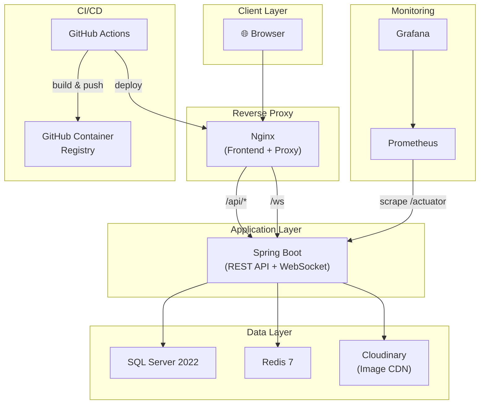

# 🎓 EduConnect — Sistem Informasi Manajemen Operasional Sekolah

> Full-stack school management system with modern DevOps practices


## 📋 Table of Contents
- [Architecture Overview](#-architecture)
- [Tech Stack](#-tech-stack)
- [Quick Start (Development)](#-quick-start)
- [Deployment (Production)](#-deployment)
- [CI/CD Pipeline](#-cicd-pipeline)
- [Monitoring & Observability](#-monitoring)
- [Project Structure](#-project-structure)
- [Testing](#-testing)
- [API Documentation](#-api-documentation)

## 🏗️ Architecture



## 🛠️ Tech Stack

| Component | Technology | Version | Description |
|-----------|------------|---------|-------------|
| **Frontend** | React, Vite | 18+ | SPA with modern UI |
| **Backend** | Spring Boot | 3.x (Java 21) | REST API & WebSockets |
| **Database** | SQL Server | 2022 | Relational Data |
| **Caching** | Redis | 7 | Rate Limiting & caching |
| **Reverse Proxy** | Nginx | latest | Web Server & proxy |
| **CI/CD** | GitHub Actions | - | Build, Test, Deploy |
| **Monitoring** | Prometheus & Grafana | - | System metrics & dashboards |

## 🚀 Quick Start

### Prerequisites
- Docker & Docker Compose
- Java 21 (for local backend development)
- Node.js 18+ (for local frontend development)

### Environment Setup
1. Copy `.env.example` to `.env`
2. Fill in the required secrets (Database, Email, Cloudinary, JWT)

### Running with Docker Compose
```bash
docker compose up -d
```

## 📦 Deployment

### Production Deployment
Production is fully containerized using Docker. All configurations are handled via environment variables and standard Docker Compose setup.

## 🔄 CI/CD Pipeline

We use GitHub Actions for continuous integration and deployment.
- **CI Workflow**: Runs on every Pull Request. Includes Maven tests, Vite lint/test, Docker image build checks, and Trivy security scanning.
- **CD Workflow**: Runs on tag `v*` and pushes to `main`. It builds semantic versioned Docker images to GitHub Container Registry (GHCR) and uses SSH to automatically deploy to the production server.

## 📊 Monitoring

The project is equipped with Spring Boot Actuator, Prometheus, and Grafana.
To spin up the monitoring stack, run:
```bash
docker compose -f docker-compose.yml -f docker-compose.monitoring.yml up -d
```
Access Grafana on port `3000` (default credentials `admin`/`admin`).

## 📁 Project Structure

```
EduConnect/
├── .github/          # GitHub Actions Workflows
├── backend/          # Spring Boot Application
├── frontend/         # React SPA (Vite)
├── monitoring/       # Prometheus & Grafana configs
├── Plan_Project/     # Documentation & Planning
├── docker-compose.yml
├── docker-compose.monitoring.yml
└── README.md
```

## 🧪 Testing

### Backend Tests
```bash
cd backend
mvn clean test -Dspring.profiles.active=test
```

### Frontend Tests
```bash
cd frontend
npm run test
```

## 📝 API Documentation
API Documentation is available via Swagger UI. Once the backend is running, visit:
`http://localhost:8080/swagger-ui/index.html` (if running locally) or through the respective Nginx proxy route.